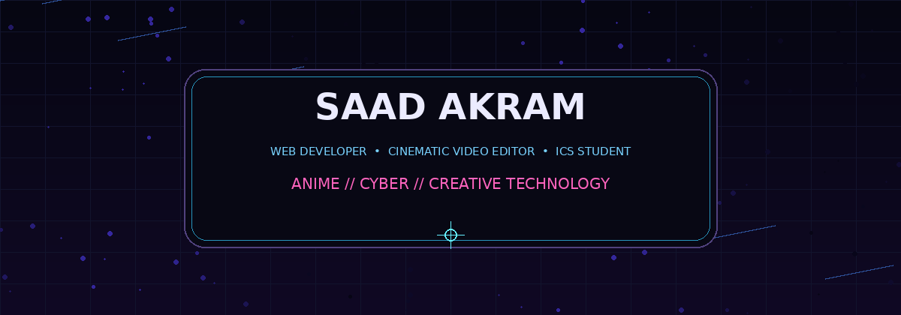
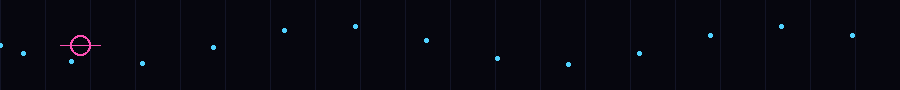

<!-- ANIME / CYBERPUNK HERO -->

# 👋 Hi there, I'm Saad Akram!

**WEB DEVELOPER** • **CINEMATIC VIDEO EDITOR** • **ICS STUDENT**

> ⚡ Building clean digital experiences with code, creativity, AI, and a little anime energy.

## 🧑‍💻 About Me

Hey there! 👋 I'm a passionate **Web Developer** focused on creating responsive, user-friendly applications. I believe in clean code, continuous learning, and pushing the boundaries of what's possible on the web.

Alongside coding, I craft clean, story-driven video edits—from short-form reels to AI-powered motion content. I love blending technology and creativity to build immersive digital experiences.

## 🛠️ Tech Stack & Skills

### 💻 Development

### 🎬 Creative & AI

## 🚀 Featured Projects

| Project | Description | Tech Stack |
|---|---|---|
| 🟢 [**ai-mirror**](https://github.com/SAADHERE1/ai-mirror) | An interactive avatar that copies your actions in real-time. | JavaScript |
| 🌐 [**Personal Portfolio**](https://github.com/SAADHERE1/SAADHERE1.github.io) | My personal portfolio website showcasing my work, skills, and journey. | HTML, CSS, JS |
| 🔐 [**Dart12 Decryptor**](https://github.com/SAADHERE1/Dart12) | A standalone decryption application built for cross-platform compatibility. | Dart |
| 🌌 [**Edge-homepage**](https://github.com/SAADHERE1/Edge-homepage) | A custom new tab page extension with shortcuts, to-do list, live clock, background presets, and a moving particle effect. | HTML, CSS, JS |

## 📊 GitHub Stats

  

## 📈 GitHub Activity

## 🤝 Let's Connect!

I'm always open to collaborating on exciting web projects, creative video edits, or AI-driven applications. Feel free to reach out!

---

> 💡 **"Passionate about clean code and continuous learning in tech."**  
> 🌲 **Quote of the day:** *"I took a walk into the woods and came out taller than the trees."*

*Last updated: August 2026*

